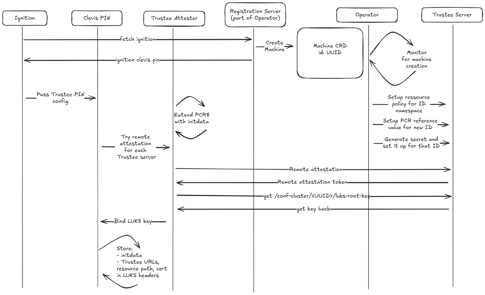

# Boot and attestation process

## Overview

This document describes the booting flow for confidential clusters with the attestation flow.

During firstboot the root disk will be encrypted by the key released after attestation, while on second boot the root disk will be decrypted upon a successful attestation.

## Clevis and Clevis Pins

**Clevis** is a framework for managing encrypted volumes that provides automated decryption of LUKS devices. It works through a plugin system called "pins" that implement specific key retrieval mechanisms. 

### Custom Clevis Pin for Trustee

The clevis pin for Trustee integrates confidential computing attestation with disk encryption.
Example of the pin configuration:
```json
{
  "servers": [
    {
      "url": "http://localhost:8080",
      "cert": ""
    }
  ],
  "path": "conf-cluster/12345/root",
  "initdata": "{ uuid: \"12345\"}"
}
```

This pin:
- **Triggers Attestation Process**: Automatically initiates the trustee attestation workflow for all the servers listed under `servers`. For fetching the secret resource, it requires to specify the path of the resource which correspond to the `path` from the config. The `initdata` contains the UUID of the node and is information embedded in the attestation reported required by the attestation and resource policy.
- **Metadata Persistence**: Stores the configuration in the LUKS header for later retrieval for the decryption.

## Operator Coordination

The **COCL (Confidential Cluster) Operator** serves as the central coordinator for the attestation and registration process. It orchestrates the entire workflow from initial cluster deployment through node attestation and secret management.

### Operator Responsibilities

1. **Ignition Generation**: Creates Ignition configurations containing Clevis pin settings with unique node identifiers
2. **Registration Service**: Provides HTTP endpoints where the Ignition with the Clevin pin configuration is served
3. **Secret Management**: Generates and registers the LUKS keys in Trustee
4. **Policy Updates**: Dynamically updates attestation and resource policies to allow authenticated nodes access to their secrets

## Firstboot Phase

During firstboot, the node boots with an Ignition configuration that merges additional configuration from the registration service. The initial Ignition contains a merge directive:

```json
{
    "ignition": {
        "config": {
            "merge": [
                {
                    "source": "http://<registration-service>/ignition"
                }
            ]
        }
    }
}
```

This merge source contacts the registration service, which provides an Ignition snippet containing the LUKS configuration with the Clevis Trustee pin:

```json
{
  "ignition": {
    "version": "3.5.0"
  },
  "storage": {
    "luks": [
      {
        "clevis": {
          "custom": {
            "config": "{\"servers\":[{\"url\":\"https://trustee1\",\"cert\":\"aaaa\"},{\"url\":\"https://trustee2\",\"cert\":\"bbbb\"}],\"path\":\"conf-cluster/12345/root\"}",
            "needsNetwork": true,
            "pin": "trustee"
          }
        },
        "device": "/dev/disk/by-partlabel/root",
        "label": "luks-root",
        "name": "root",
        "wipeVolume": true
      }
    ]
  }
}
```

### Firstboot Process Flow

1. **Initial Boot**: Node boots with base Ignition containing merge configuration
1. **Registration Contact**: Ignition merge contacts the registration service at the specified URL
1. **LUKS Configuration**: Registration service provides the Trustee pin configuration
1. **Attestation**: Clevis pin triggers attestation with the Trustee server to retrieve the encryption key
1. **Volume Setup**: Root filesystem is encrypted


## Node Registration

When the Ignition merge directive contacts the registration service to fetch the pin configuration, the operator performs several critical registration tasks to prepare the node for attestation.

### Registration Process Flow

1. **UUID Generation**: Operator generates a unique UUID for the node
1. **Ignition Request**: Generate and returns Ignition with the pin configuration and the UUID
1. **Machine Object Creation**: Operator creates a Kubernetes Machine object containing the UUID

### Automatic Provisioning Upon Machine Detection

The Confidential Cluster operators watches for Machine objects and when it detects a new Machine object:

1. **UUID Extraction**: Extracts the UUID from the Machine object
1. **LUKS Key Generation**: Generates a LUKS encryption key for the node
1. **Secret Creation**: Creates a Kubernetes Secret containing the LUKS key
1. **Trustee Registration**: Registers the LUKS key with Trustee using the UUID as the secret path
1. **Policy Updates**: Updates both attestation and resource policies to allow the authenticated node access to its secrets

### Attestation Policy Example

PCR 8 contains the digest of the initdata and in our case, the UUID. The attestation policy validates PCR8 against expected values using the node's UUID as index:

```
pcr8 = expected_pcrs8[UUID]
pcr8 == input.tpm.pcrs[8]
```

### Resource Policy Example

The resource policy ensures nodes can only access their own secrets by validating the UUID in the resource path matches the node's initdata:

```
uuid := split(input.resource_path, "/")[1]
input.initdata.uuid = uuid
```



## Second boot

On second boot, the attestation process is streamlined since the Clevis pin is already bound to the LUKS volume and all configuration is stored in the LUKS header.

### Second boot Process Flow

1. **Configuration Retrieval**: Pin extracts the stored attestation servers and secret path from the header metadata
1. **Attestation Execution**: Pin performs attestation with the configured Trustee servers
1. **Secret Request**: Pin requests the LUKS key from Trustee using the stored secret path
1. **Key Retrieval**: Upon successful attestation, Trustee returns the LUKS encryption key
1. **Disk Decryption**: Pin uses the retrieved key to decrypt the root disk
