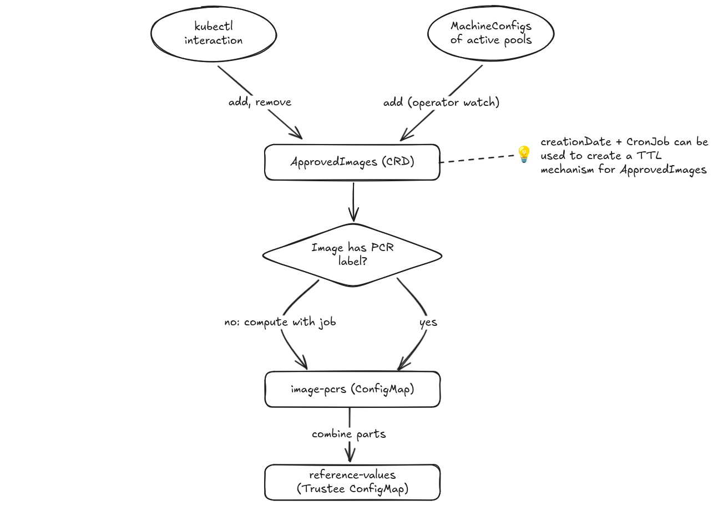

# Reference values data flow

## Overview

Attestation in Confidential Clusters is based on PCR values reported by a TPM.
These values can be predicted when the exact OS the node is expected to be used is known, by means of the [compute-pcrs](https://github.com/confidential-clusters/compute-pcrs) library.
In the design of Confidential Clusters, the OS is represented by a bootable container image with a [UKI](https://uapi-group.org/specifications/specs/unified_kernel_image).

This document describes how a bootable image tag becomes approved and revoked, and how the set of approved image tags is turned into reference values to be used by Trustee's [reference value provider service](https://github.com/confidential-containers/trustee/tree/main/rvps).

## Dual source for approved images: MachineConfigs & kubectl interaction

In OpenShift, updates to nodes are defined using Kubernetes resources.
The `MachineConfig` CR can be applied to e.g. define the bootable image reference which nodes classified by some selector should use.
Target machine configs are then referenced to in `MachineConfigPools`.
Because such explicit updates are assumed to be intended by the cluster administrator, the Confidential Clusters operator can watch the MachineConfigPools and set the images that they reference as approved.

However, kubectl interaction is also supported, both for avoiding reliance on OpenShift and for manual intervention.

## Split data store: CRD for approved images, ConfigMap for PCR parts

For better interaction with kubectl, approved images are specified as a very simple custom resource:

```yaml
apiVersion: confidential-containers.io/v1alpha1
kind: ApprovedImage
metadata:
  name: my-scos
  namespace: confidential-clusters
spec:
  reference: quay.io/my-registry/scos-kernel-layer
```

When images are read from the MachineConfigs, their CRs are given an RFC1035-compliant unique name derived from the image URL, such as `3c2052768d-quay-io-okd-scos-content-3813e6608a999756931d3d6219` for `quay.io/okd/scos-content:3813e6608a999756931d3d621932af9662860e71a552b2670f9fe320bf0d3585`
The `creationDate` on this CR can also be used to define a CronJob to create a TTL mechanism for images.

However, for efficient operation, the operator must cache the PCR parts and values that each image has.
Internally, this is stored in a ConfigMap using JSON, which also does not have the formatting limitations of a CR name.

```json
{
  "quay.io/okd/scos-content:3813e6608a999756931d3d621932af9662860e71a552b2670f9fe320bf0d3585": [
    {
      "id": 4,
      "value": "551bbd142a716c67cd78336593c2eb3b547b575e810ced4501d761082b5cd4a8",
      "parts": [
        {
          "name": "EV_EFI_ACTION",
          "hash": "3d6772b4f84ed47595d72a2c4c5ffd15f5bb72c7507fe26f2aaee2c69d5633ba"
        },
        ...
      ]
    },
    {
      "id": 7,
      ...
    },
    ...
  ],
  ...
}
```

## PCR label readout & fallback computation

The values and parts given in the JSON above can be precomputed at image creation time by means of setting the `org.coreos.pcrs` label.
If they are not present, a compute-pcrs job is used to compute them.
This job uses the bootable image as an [image volume](https://kubernetes.io/docs/tasks/configure-pod-container/image-volumes/), which makes it possible to use an image that may already have been pulled instead of downloading it.
Because they are bootable, these images generally run many hundreds of megabytes large.

## Reference value computation

If nodes were never updated, the `value` specification from the JSON above would suffice.
However, if and when they are updated, the `parts` must also be taken into account as UKI and bootloader components update on separate boots.
Because a node could be updated again before the second reboot, many combinations of UKI and bootloader components would be considered valid.
Upon every change of the image PCRs, the reference values that are utilised by Trustee are recomputed with respect to all of these combinations using compute-pcrs.
A reference value listing for Trustee could then look like this:

```json
[
  {
    "version": "0.1.0",
    "name": "tpm_pcr4",
    "expiration": "2026-10-02T13:00:13Z",
    "value": [
      "551bbd142a716c67cd78336593c2eb3b547b575e810ced4501d761082b5cd4a8"
    ]
  }
  ...
]
```

## Data flow


